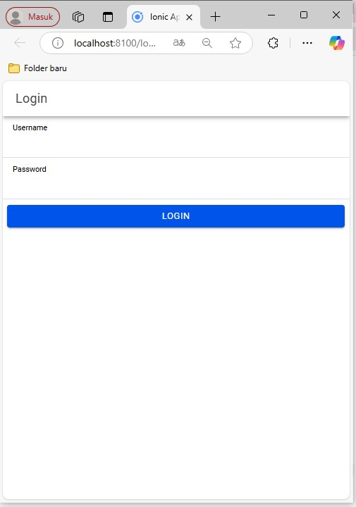

# PrakMobile_Pert8
Praktikum Pemrograman Mobile Pert 8

Nama  : SOLANI
NIM   : H1D022033

Penjelasan

1. Form Login di login.page.html
Pengguna memasukkan username dan password pada form login yang disediakan.
Ketika pengguna mengklik tombol "Login", metode login() di LoginPage dipanggil.

2. Metode Login di login.page.ts
Metode login() di komponen LoginPage melakukan validasi awal untuk memastikan bahwa username dan password tidak kosong.
Jika data valid, maka login() akan membuat objek data berisi username dan password pengguna.
Data ini kemudian dikirim ke server melalui postMethod() dari AuthenticationService, mengarahkan data tersebut ke login.php yang berfungsi sebagai endpoint login server.

3. Mengirim Data ke Server di AuthenticationService
postMethod() adalah metode dalam AuthenticationService yang mengirim permintaan POST ke API server dengan data login yang diberikan.
URL API diambil dari apiURL() yang menunjuk ke endpoint http://localhost/coba-login.
Jika login berhasil (res.status_login == "berhasil"), server akan memberikan respons dengan token autentikasi dan nama pengguna yang berhasil login.

4. Menyimpan Data Autentikasi dengan saveData()
Jika login berhasil, metode saveData() dipanggil untuk menyimpan token autentikasi dan nama pengguna menggunakan Capacitor Preferences.
saveData() menyimpan token ke TOKEN_KEY dan nama pengguna ke USER_KEY, yang juga mengubah status autentikasi menjadi true menggunakan isAuthenticated.next(true).
Setelah data tersimpan, pengguna diarahkan ke halaman Home menggunakan router.navigateByUrl('/home').

5. Melindungi Rute dengan authGuard dan autoLoginGuard
authGuard digunakan untuk mencegah akses ke halaman Home jika pengguna belum login.
authGuard mengecek status autentikasi dari authenticationState. Jika pengguna belum login, maka mereka diarahkan kembali ke halaman Login.
autoLoginGuard digunakan untuk mengarahkan pengguna langsung ke halaman Home jika mereka sudah login dan mencoba mengakses halaman Login kembali.
Jika pengguna sudah login, maka mereka akan diarahkan ke halaman Home secara otomatis.

6. Menampilkan Halaman Home di home.page.html
Pada halaman Home, pengguna disambut dengan pesan "Selamat datang" beserta nama pengguna yang tersimpan di nama.
Terdapat juga tombol "Logout" yang memanggil metode logout() di HomePage.

7. Logout dengan Metode logout() di HomePage
Ketika pengguna mengklik tombol "Logout", metode logout() di AuthenticationService dipanggil.
logout() menghapus data autentikasi dari Capacitor Preferences dan mengubah status autentikasi menjadi false.
Setelah itu, pengguna diarahkan kembali ke halaman Login.

